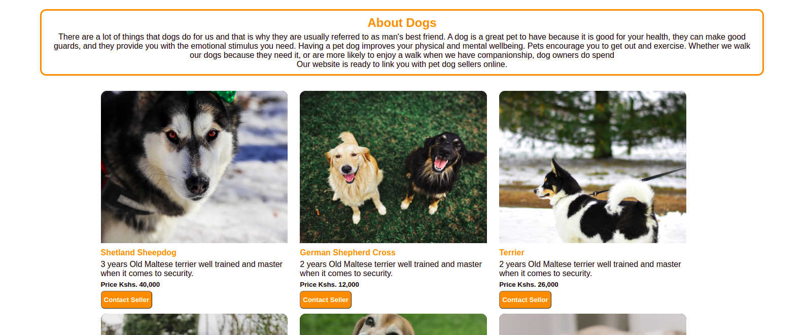
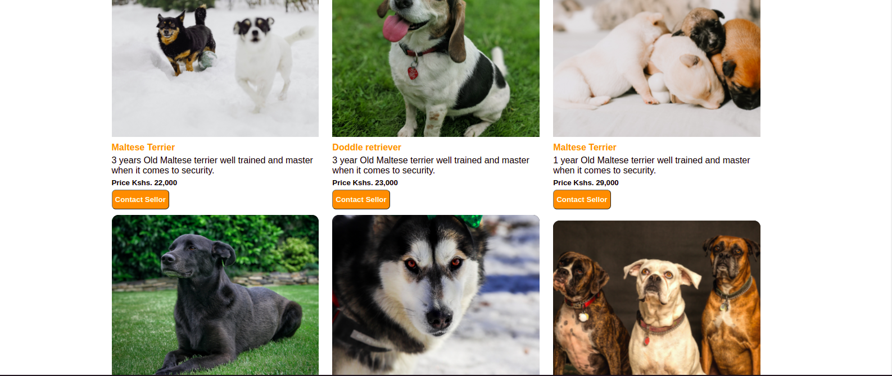
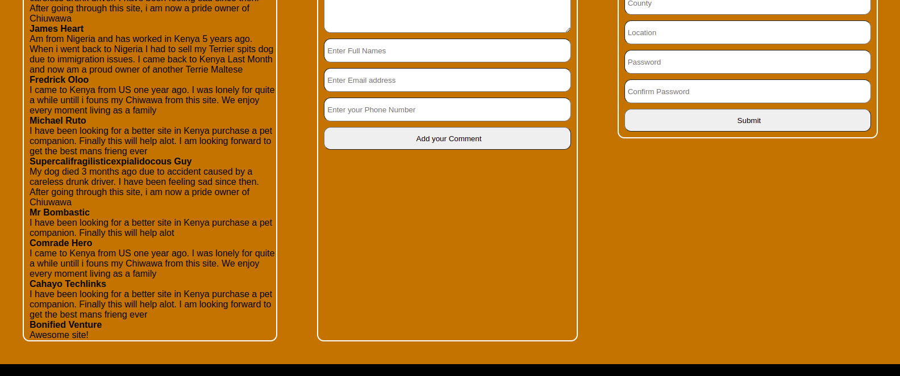

# Pet Dogs Website
*****
### Author : Earnest Achayo Date 22/6/2022
****
## Project Description
This is a pet dogs website that will help customer who likes pet dogs companion and would like to reach the sellers around Kenya . It contains a grid view of differents breeds available plus the cost price and the owners contact details for interested buyers to link up and negotiate.
******

## SCREENSHOTS
 
 
 
 
 
 

********
## SetUp Instruction
### Requirements
* Text editor eg [Visual Studio Code](https://code.visualstudio.com/download)

### Getting Files
* Fork the repo
- Create a new branch in your terminal (git checkout -b improve-feature)
- Install the prerequisites
- Make appropriate changes in file(s)
- Run the server to see the changes
- Add the changes and commit them (git commit -am "Improve App")
- Push to the branch (git push origin improve-app)
- Create a Pull request
* Open the folder location on terminal and use the following command to run app:

## How To Run It
>  $ Run it under any browser
*****
## Live Link
Or you can access the web application directly via this [LINK.](https://)
You can access the figma design of the website via this [LINK.](https://www.figma.com/file/rx0GucWSLYQOLbUEdeDYf1/Online-Pet-shop?node-id=0%3A1)
*****
## Technologies Used
1. HTML
2. CSS
3. JavaScript
4. Json 

*****
## Contact Information
* Email : earnest.achayo@student.moringaschool.com
*****
## [License](LICENSE)
MIT License
Copyright (c) 2022 Earnest Achayo